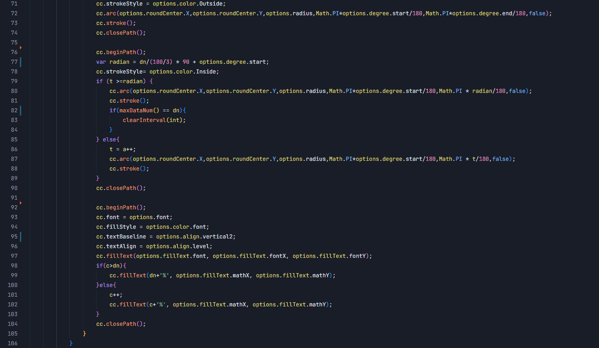

# Git Loupe 🔍

Instantly discover who, when, and why a line of code was changed. **Git Loupe** is a lightweight, high-performance VS Code extension that provides unobtrusive inline Git blame annotations and a powerful hover card featuring smart contextual diff snippets.

No bloated menus, no heavy background processes. Just the exact Git information you need, exactly when you need it.

## ✨ Features

* **Inline Blame Annotations:** Displays a subtle, dim annotation at the end of the current active line showing the author, relative time, and commit message.

* **Rich Hover Details:** Hover over the active line to reveal an elegantly formatted card with full commit details, precise timestamps, and the author's email.

* **Smart Contextual Diff (Killer Feature):** Unlike other extensions that struggle with diff alignment, Git Loupe extracts the precise red/green diff snippet for the specific change. Powered by Git's advanced `histogram` algorithm, it displays context around the specific change making it incredibly easy to understand *what* exactly changed.

* **Uncommitted Changes Support:** Instantly view the diff for your current, uncommitted workspace changes against the `HEAD` right in the hover card.

* **Highly Optimized:** Completely event-driven to ensure zero impact on your editor's performance.

## 🚀 See it in Action

## ⚙️ Requirements

* **Git** must be installed on your system and accessible from the command line/system path.

* Visual Studio Code `1.93.1` or higher.

## 📦 Extension Settings

This extension contributes the following settings:

* `gitloupe.maxDiffLines`: Controls the maximum number of lines to display in the hover diff snippet context. **(Default: 1)**. Increase this number if you prefer to see more surrounding code context within the red/green diff view.

## 🐛 Known Issues

* None currently reported. If you find any issues or have feature requests, please open an **[Issue](https://github.com/crown-li/gitLoupeIssue/issues)** on the GitHub repository.

## 📝 Release Notes

### 1.0.2

* Initial release of Git Loupe! 🎉
* Added inline line blame annotations.
* Added rich hover card with author details and commit hash.
* Implemented smart `histogram` diff extraction for contextual code changes.
* Added support for real-time uncommitted changes diff viewing.
* Added customizable setting `gitloupe.maxDiffLines` to adjust hover diff length.

### 1.0.3

* Compatible with lower versions of VSCode `1.93.1`.

---

**Enjoy exploring your code history with Git Loupe!**