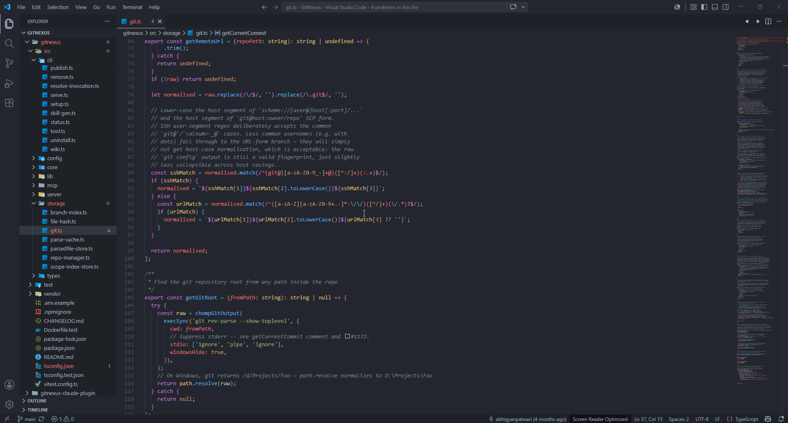
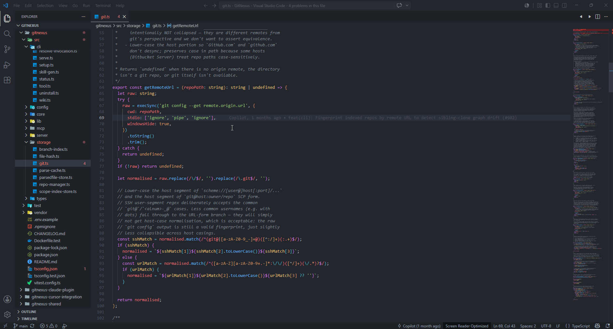
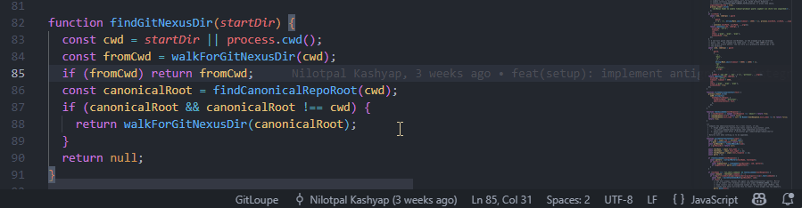
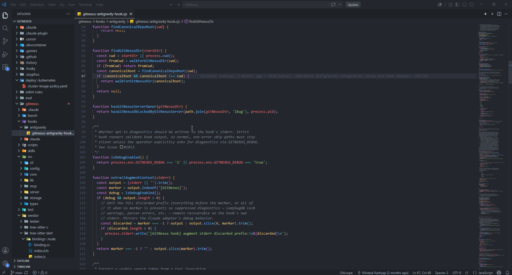

<div align="center">
  
</div>
<br>
<p align="center" dir="auto">
  <a href="https://marketplace.visualstudio.com/items?itemName=gitloupe.git-loupe"></a>
  <a href="https://open-vsx.org/extension/gitloupe/git-loupe"></a>
</p>

<p align="center">
  <kbd>&nbsp; 🇺🇸 <a href="https://github.com/crown-li/gitLoupeIssue/blob/main/DETAIL.md">English</a> &nbsp;</kbd>
  &nbsp;&nbsp; | &nbsp;&nbsp;
  <kbd>&nbsp; 🇨🇳 <a href="https://github.com/crown-li/gitLoupeIssue/blob/main/DETAIL.zh-CN.md">简体中文</a> &nbsp;</kbd>
</p>

# Git Loupe 🔍

Instantly discover who, when, and why a line of code was changed. **Git Loupe** is a lightweight, high-performance VS Code extension that provides unobtrusive inline Git blame annotations and a powerful hover card featuring smart contextual diff snippets.

No bloated menus, no heavy background processes. Just the exact Git information you need, exactly when you need it.

## ✨ Features

* **Inline Blame Annotations:** Displays a subtle, dim annotation at the end of the current active line showing the author, relative time, and commit message.

* **Rich Hover Details:** Hover over the active line to reveal an elegantly formatted card with full commit details, precise timestamps, and the author's email.

* **Smart Contextual Diff (Killer Feature):** Unlike other extensions that struggle with diff alignment, Git Loupe extracts the precise red/green diff snippet for the specific change. Powered by Git's advanced `histogram` algorithm, it displays context around the specific change making it incredibly easy to understand *what* exactly changed.

* **Uncommitted Changes Support:** Instantly view the diff for your current, uncommitted workspace changes against the `HEAD` right in the hover card; Click on hash to view `diff view`.

* **Diff View:** Click on the navigation in the upper right corner of the page to switch between Previous Version and Next Version, and compare the differences.

* **Status Bar** Status bar tooltip showing commits count, contributors list, and last modified time.

* **Highly Optimized:** Completely event-driven to ensure zero impact on your editor's performance.

* **Emoji Support:** Expanded the built-in emoji library, allowing for the use of emoji expressions to describe submission types when submitting code.

## 🚀 See it in Action

### Hover Card


### Diff View


### Status Bar


### Emoji Support



## ⚙️ Requirements

* **Git** must be installed on your system and accessible from the command line/system path.

* Visual Studio Code `1.93.1` or higher.

## 📦 Extension Settings

This extension contributes the following settings:

* `gitloupe.maxDiffLines`: Controls the maximum number of lines to display in the hover diff snippet context. **(Default: 1)**. Increase this number if you prefer to see more surrounding code context within the red/green diff view.

```json
{
  "gitloupe.maxDiffLines": 1
}
```

## 🐛 Known Issues

* None currently reported. If you find any issues or have feature requests, please open an **[Issue](https://github.com/crown-li/gitLoupeIssue/issues)** on the GitHub repository.

---

**Enjoy exploring your code history with Git Loupe!**