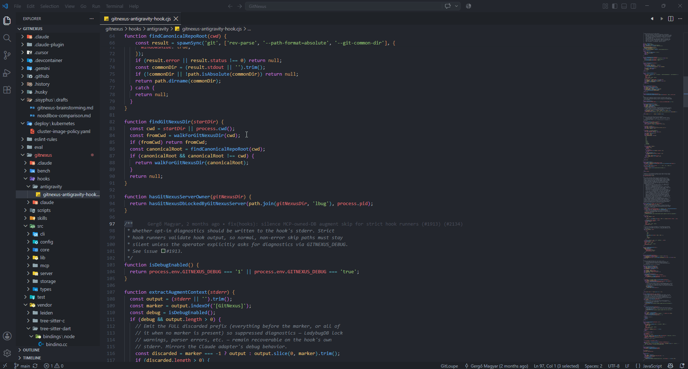

<div align="center">
  
</div>
<br>
<p align="center" dir="auto">
  <a href="https://marketplace.visualstudio.com/items?itemName=gitloupe.git-loupe"></a>
  <a href="https://open-vsx.org/extension/gitloupe/git-loupe"></a>
</p>

<p align="center">
  <kbd>&nbsp; 🇺🇸 <a href="https://github.com/crown-li/gitLoupeIssue/blob/main/DETAIL.md">English</a> &nbsp;</kbd>
  &nbsp;&nbsp; | &nbsp;&nbsp;
  <kbd>&nbsp; 🇨🇳 <a href="https://github.com/crown-li/gitLoupeIssue/blob/main/DETAIL.zh-CN.md">简体中文</a> &nbsp;</kbd>
</p>

# Git Loupe 🔍

立即发现一行代码是被谁、在什么时候、因为什么原因修改的。**Git Loupe** 是一款轻量级、高性能的 VS Code 插件，它提供无干扰的内联 Git blame 注解，以及一个包含智能上下文差异（diff）代码片段的强大悬停卡片。

没有臃肿的菜单，没有沉重的后台进程。只在您需要的时刻，为您提供确切的 Git 信息。

## ✨ 功能特性

* **内联 Blame 注解：** 在当前活动行的末尾显示一个轻量、柔和的注解，展示作者、相对时间和提交信息。

* **丰富的悬停详情：** 将鼠标悬停在活动行上，即可显示格式优雅的卡片，其中包含完整的提交详情、精确的时间戳以及作者的电子邮件。

* **智能上下文差异（杀手级功能）：** 与其他难以对齐差异的插件不同，Git Loupe 会提取特定更改的精确红/绿差异片段。在 Git 高级 `histogram` 算法的支持下，它能显示特定更改周围的上下文，让您极其轻松地理解确切发生了*什么*改变。

* **支持未提交更改：** 直接在悬停卡片中，即时查看当前工作区未提交的更改与 `HEAD` 的差异；点击哈希值可进入 `差异视图`（diff view）。

* **差异视图：** 点击页面右上角的导航，在“上一版本”和“下一版本”之间切换，并比较差异。

* **状态栏：** 状态栏提示会显示提交总数、贡献者列表和最后修改时间。

* **高度优化：** 完全事件驱动，确保对编辑器的性能零影响。

* **Emoji 支持：** 扩展了内置 Emoji 库，提交代码时可以使用 Emoji 表情来描述提交类型。

## 🚀 实际演示

### 悬停卡片


### 差异视图


### 状态栏


### Emoji 支持



## ⚙️ 运行要求

* 您的系统上必须已安装 **Git**，并且可以从命令行/系统路径访问。

* Visual Studio Code `1.93.1` 或更高版本。

## 📦 插件设置

此插件提供以下设置：

* `gitloupe.maxDiffLines`：控制在悬停差异代码片段上下文中显示的最大行数。**（默认值：1）**。如果您希望在红/绿差异视图中看到更多周围的代码上下文，请增加此数值。

```json
{
  "gitloupe.maxDiffLines": 1
}
```

## 🐛 已知问题

* 暂未收到相关报告。如果您发现任何问题或有功能请求，请在 GitHub 仓库中提交 **[Issue](https://github.com/crown-li/gitLoupeIssue/issues)**。

---

**尽情使用 Git Loupe 探索您的代码历史吧！**